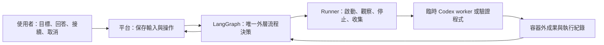

# 候選架構與責任

狀態：進入正式設計，以下技術選項仍為候選，尚未完成產品選型或實作。整理日期：2026-09-11。產品權威見[產品範圍](../product.md)，討論方法與順序見[設計入口](README.md)。

推薦先保留一個小型產品應用，內含 LangGraph 外層流程、執行 adapter 與認證模組，管理可拋棄 Codex workers。元件責任分開不代表每個都要獨立服務。

## 技術候選

| 部分 | 建議 | 取捨與替代 |
| --- | --- | --- |
| 後端 | Python＋FastAPI，與 LangGraph 同一應用 | 可減少跨語言流程接線；全 TypeScript 仍是相關替代，沒有現有程式強制選擇。 |
| 流程 | LangGraph library＋持久化 checkpointer | 採用既有等待、恢復與狀態機制；仍需自己定義產品規則。若外面又包完整 controller，須縮減或重議。 |
| Executor | 優先驗證 Codex app-server＋平台集中認證 | 從最初 exec 候選調整，原因是短效 token 與刷新回呼；仍沿用 Codex harness。API key＋exec 為較簡單替代，SDK 依接口與版本適配評估。 |
| 執行平台 | 單一主機，Compose 管平台服務，Docker Engine 建立臨時 workers | 不先引入 K8s／多節點；主機檔案掛載與 test services 要在實際端點驗證。 |
| 儲存 | 技術切片先評估 SQLite＋持久目錄 | 多個 worker 不必各自寫平台 DB；若選定多程序寫入或有併發需求，評估 PostgreSQL。SQLite 能否符合本次使用方式仍待驗證。 |
| UI | React＋TypeScript＋Vite；工作頁、配置預覽、成果及待回答問題 | 增加前端工具鏈責任；先不實作，普通 HTTP／輪詢即可列候選。 |
| GitHub | Git＋必要時 gh／API；限定 repo 的 PAT 或 GitHub App | PAT 設定較少，App 增加安裝與 token 生命週期管理；模型認證與 GitHub 認證分開。MCP 不必然需要。 |

初步 repo 建議為平台與 worker 兩個粗粒度歸屬；平台包含 UI、API、流程、runner adapter 與部署配置，worker 包含 image、入口與結果契約。共用內容有獨立維護需要再拆。代價是平台與 worker 必須檢查契約版本相容；目前不建這些 repos。

## 控制權

單一控制權可以管理多個並行工作，不等於全平台序列執行。LangGraph 決定外層下一步與修正額度；runner 回報事實，不另決定重試整件工作；Codex 自主處理工作內的探索與一般修正。

Code 工作由另一個 agent review 已是 [workflow 的明確要求](workflow.md#code-工作的獨立-review)。開發與 review 共用 image、分容器與 context 仍是技術候選，以清楚交接固定候選，代價是增加啟動與準備成本；不能把「另一個 agent」直接解讀成上述隔離機制均已選定。認證模組只處理登入／刷新，不成為另一個流程決策者。

## 資料權威

| 資料 | 主要位置與責任 |
| --- | --- |
| 工作目標、留言、回答、採納與授權 | 平台資料庫；UI 不自行推進流程。 |
| 流程位置、待回答點、剩餘修正額度 | LangGraph checkpoint；顯示狀態由此導出。 |
| Attempt、容器身分、啟停與外部操作觀測 | 平台執行紀錄；容器識別可與 attempt 核對。 |
| 共用指引、模式與 skills 原稿 | 版本化配置來源；不默認改變正在執行的工作。 |
| 專案文件與程式 | 原 repo 指定版本；不建立持續同步的全文知識庫。 |
| 有效配置、報告、候選與驗證紀錄 | 容器外持久目錄；只把必要索引與引用放進流程狀態。 |
| 模型與 GitHub 認證 | 各自的受限儲存；不進入 checkpoint 或一般成果。 |

Checkpointer 不等於跨工作知識庫，也不保存任意外部程序。派發前保存 attempt 身分，重進時先核對既有容器／成果，避免節點重跑造成重複執行；具體邊界見[工作生命週期](workflow.md)。

## Clarification 帶來的待決接縫

本節為待設計事項，來源：[02-clarification](../../discuss/02-clarification/README.md) O01–O02、O07–O08。已確認行為以 [workflow 的連續性](workflow.md#clarification-的連續性)與 [configuration 的能力缺口](configuration.md#任務期間的依賴與能力缺口)為準；既有「臨時 worker」候選不能直接解讀為每輪問答後立即刪除原 session。

- 需辨明 Codex session／thread、app-server 程序與 worker 容器的保存責任及成本；保留原 session 不先推定為容器無期限長駐，也不先假定重建一定能無損接續。
- 新依賴或能力如何提供、是否需要重啟環境／session，以及如何符合正常澄清的連續性，仍須選方案。手動中斷後恢復可省略的偏好，不能直接用作任意環境重啟的例外。
- 依賴補裝可以授權，但網路、安裝權限、配置記錄與重建方式未定；新增外部服務不預設由通用開通元件處理。

上述事項限制後續技術選擇，尚不新增 runner API、永久協調角色、LangGraph nodes 或自動環境修復流程；本次統整沒有新增實驗證據。

## 05 帶來的配置與恢復接縫

本節只列候選架構的相依問題，行為基準各由連結目標維護：

- [角色配置初始化](configuration.md#當次-agent-角色與配置初始化候選)是使用者候選：在既有組裝方向中準備當次 agent 的指引與任務，不先建永久協調角色、完整生成系統或固定 graph nodes。
- [工作內探索接手](workflow.md#工作內的探索接手)的已確認目的是降低後續探索成本，共用暫存區尚未選定。需核對與現有成果目錄／索引的關係、保存與維護責任，以及 reviewer 可讀哪些資料；不直接增加另一份權威狀態或完整對話副本。
- [PR 後修改入口](workflow.md#pr-後修改與交付)須比較 GitHub 留言整合與回平台留言的實作及維護成本；平台留言已是可接受替代，不預設必須有 GitHub App、webhook 或輪詢服務。
- [主動終止與意外恢復](workflow.md#取消中斷與認證失效)已有產品分界。後續需設計如何識別已終止 run、接續或重跑，以及核對已發生的外部操作；不得用既有「不重跑」候選概括排除明確允許的恢復方式。這仍不是程序復活、無限重試或所有環境問題自動修復的承諾。

沒有新增技術實測、服務或實驗；上述問題不改變單一外層控制權的候選分工。

## 收斂條件

A–E 的指定切片已提供配置、外層流程與真實整合證據，依[設計入口](README.md)從使用情境與工作狀態收斂元件及契約，不再把已完成切片列為開始設計的前置條件。實驗結論與限制以[各組結果](../experiments/README.md)為準，不能推論所有候選均已選定。

[認證](authentication.md)的真實登入／刷新、首版遠端 repo 準備與長駐平台的資料一致性，依所屬設計決策安排針對性驗證；E6 的紀錄完整性容忍條件在[工作生命週期](workflow.md)討論。技術選擇需說明實驗證據、接受的限制及重新評估條件，不直接搬用 lab 作為正式產品實作。

App-server／SDK 的公開接口存在不代表固定版本、容器環境或帳號已通過驗收；官方與本機查核範圍見[來源](../references.md)。
