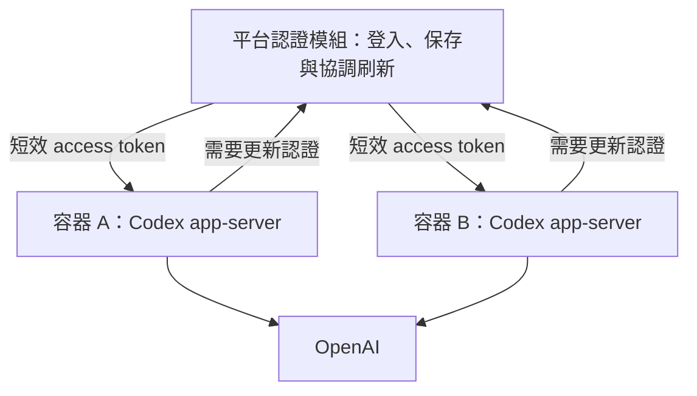

# 認證與平行執行

狀態：平台集中認證＋Codex app-server 仍是候選；A 組已完成實驗實作並取得部分真實與模擬證據，見[驗證結果](../../lab/A/RESULTS.md)。這不代表完整平台認證模組已實作或選型。整理日期：2026-09-10。

認證刷新協調與模型工作併發是不同問題。單一容器可以包含多個 Codex 程序，多個容器也可以並行；容器本身不解決多程序共用 refresh token 的生命週期。沒有採納全平台只能一個 run 的限制。

## 優先候選：平台保存長效認證，worker 取得短效 token

1. 平台透過已確認可用的登入方式取得認證，將 refresh token 保存在受限位置。
2. Worker 啟動自己的 app-server，平台以控制連線的 `account/login/start`、`chatgptAuthTokens` 模式注入 access token 與帳號識別；不寫入命令列、一般環境變數或成果。
3. Worker 自主執行模型與工具工作；平台不代理每次模型請求，也不接管內部 loop。
4. Codex 可透過 `account/chatgptAuthTokens/refresh` 要求更新。平台協調同一份認證的刷新，保存更新結果後回覆，其餘請求沿用更新結果。
5. 刷新失敗、撤銷或平台無法回覆時，保存現有成果並清楚停止／接手；不重跑整件工作或默默切 API。

這個模組可先留在同一平台應用，不必獨立服務。它增加登入、刷新、保存與重新登入責任，省掉各 worker 各自輪替相同長效認證的競爭。短效 token 仍是帳號存取權，不是工作專屬授權；取消單一工作不等於立即撤銷 token，所有 workers 仍共用帳號額度。

官方提供上述外部 token 模式，但目前標為 experimental，供已管理使用者認證生命週期的 host app 使用，且需初始化時啟用 experimental API。刷新回呼成功後會重試原請求，等待約十秒。接口存在不代表平台已具備適用的 OAuth 登入／刷新實作。[官方 app-server](https://developers.openai.com/codex/app-server/)

## 相關替代

| 路線 | 能省掉什麼 | 增加或保留的責任 |
| --- | --- | --- |
| API key＋Codex exec／app-server | OAuth token 刷新協調；保留 Codex harness，無需自寫 agent loop | API 用量計費、速率與費用控制；不是無限併發。 |
| Codex 自管 auth.json | 平台不直接管理 OAuth 刷新 | 多程序共用／多份副本、回存與失效處理仍需驗證；不能把檔案複製當作解決方案。 |
| 採用既有整合 | 可能沿用既有認證實作 | 需核對授權、接口穩定性、依賴與產品模型是否合適，不為一個接縫採用整套平台。 |

API key 是官方自動化建議；訂閱與 API 計費分開，fallback 預設不自動發生。特定 ChatGPT-managed CI/CD 指南禁止該流程用於公開／開源 repositories；不能把此限制推成一般 Codex 全面禁止，也不能假設改用 external tokens 就已確認所有情境適用。[非互動模式](https://learn.chatgpt.com/docs/non-interactive-mode)、[CI/CD 認證指南](https://learn.chatgpt.com/docs/auth/ci-cd-auth)

## 其他專案提供的證據

| 專案 | 本次實際查到的做法 | 判斷界線 |
| --- | --- | --- |
| Hermes | 官方文件描述 credential pool 的程序內鎖與跨程序刷新檔案鎖；刷新時重讀認證並沿用已更新 token | 文件機制，不是本機實測。其 Codex provider 不必安裝 Codex CLI，不能等同多個 exec。 |
| OpenClaw | Codex app-server 外部 token 整合；refresh token 留在外層，Codex 在記憶體使用短效 token，需要更新時回呼外層 | 最接近本候選的文件先例；不能直接當作本平台已驗收或使用條件已確認。 |
| Multica 原生 | 查閱的上游與本機固定版皆為每工作配置／session 分開，auth.json 連結共用來源 | 此段程式能證明共用方式，不能證明同時刷新完全可靠。 |
| Multica-local | 本機 runtime 複製專用 runner 認證並唯讀掛入角色容器 | 自訂轉接層，不等同集中刷新服務，不作長期並行刷新成功證據。 |

具體文件、程式與查核版本集中在[來源索引](../references.md)。

## 優先驗證的未知

平台的登入／刷新實作來源、帳號與 repo 情境適用性、短效 token 注入、真實併發、同時刷新、刷新途中中斷、撤銷／額度耗盡、日常認證共存及秘密保存。完整目標與通過條件見 [A 組](../experiments/a-authentication.md)。

模擬刷新成功不等於真實 OAuth 刷新通過；短任務並行成功也不證明長期可靠。若維護責任過大，回到 API 或既有整合比較，不先承諾訂閱路徑一定成立。
